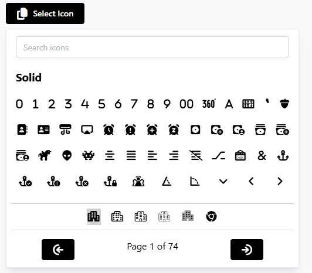

# React Supacons Mantine
<div>

[](https://www.npmjs.org/package/axios)
[](https://packagephobia.com/result?p=react-supacons-mantine)
[](https://npm-stat.com/charts.html?package=react-supacons-mantine)

</div>

React Supacons Mantine is a React component library that integrates with the Supacons Core Icon Library, providing an icon selector component built with Mantine UI (tested on v6).

## Installation

To install the library, use the following command:

```bash
  npx react-supacons-mantine -h # To see the help message
  npx react-supacons-mantine add -h # To see the help message for the add command
  npx react-supacons-mantine add [component] # To add a specific component to your project
```

## Available Components

| Component           | Type      | Command                                          | Description                                                                                                            |
|---------------------|-----------|--------------------------------------------------|------------------------------------------------------------------------------------------------------------------------|
| `PopoverSearchIcon` | component | npx react-supacons-mantine add PopoverSearchIcon | The PopoverSearchIcon component is a React component that provides a searchable popover interface for selecting icons. |

## Usage

To use the `PopoverSearchIcon` component, import it into your React application:

```typescript jsx
import React from 'react';
import { MantineProvider } from '@mantine/core';
import PopoverSearchIcon from './components/PopoverSearchIcon';

const App = () => {
  const handleIconSelect = (iconName: string) => {
    console.log(`Selected icon: ${iconName}`);
  };

  return (
    <MantineProvider>
      <PopoverSearchIcon onSelect={handleIconSelect} />
    </MantineProvider>
  );
};

export default App;
```

### Example with Config

To use the `PopoverSearchIcon` component with a configuration object:

```typescript jsx
import React, {useState} from 'react';
import {MantineProvider} from '@mantine/core';
import PopoverSearchIcon from './components/PopoverSearchIcon';

const App = () => {
    const [isDarkMode, setIsDarkMode] = useState(false);

    const handleIconSelect = (iconName: string) => {
        console.log(`Selected icon: ${iconName}`);
    };

    const config = {
        resultsPerPage: 52,
        availableStyles: ["solid", "sharp"],
        contentColor: isDarkMode ? "#fff" : "#000",
        contentSize: 18,
        searchLabel: "Search icons",
        paginationLabel: "Page %d of %s",
        buttonLabel: "Select Icon",
        buttonIconName: "fa-solid fa-copy",
        buttonIconSize: 20,
        buttonIconColor: isDarkMode ? "#000" : "#fff",
        buttonColor: isDarkMode ? "#fff" : "#000",
        showBothIconAndText: true,
        noIconsFoundText: "No icons found",
    };

    return (
        <MantineProvider>
            <PopoverSearchIcon onSelect={handleIconSelect} config={config}/>
        </MantineProvider>
    );
};

export default App;
```

### Example with and without configuration

| Not Configured | Configured |
|----------------|------------|
|  |  |

## Props

### `PopoverSearchIcon`

| Prop       | Type     | Description                                                                 |
|------------|----------|-----------------------------------------------------------------------------|
| `onSelect` | function | Callback function that is called when an icon is selected.                  |
| `config`   | object   | Configuration object for customizing the component's behavior and appearance.|

### `config` Object

| Property                | Type     | Description                                                                 |
|-------------------------|----------|-----------------------------------------------------------------------------|
| `resultsPerPage`        | number   | Number of icons to display per page.                                        |
| `availableStyles`       | string[] | Array of available icon styles.                                             |
| `contentColor`          | string   | Color of the icons.                                                         |
| `contentSize`           | number   | Size of the icons.                                                          |
| `buttonLabel`           | string   | Label for the button that opens the popover.                                |
| `buttonIconName`        | string   | Name of the icon to display on the button.                                  |
| `buttonIconSize`        | number   | Size of the icon on the button.                                             |
| `buttonIconColor`       | string   | Color of the icon on the button.                                            |
| `buttonColor`           | string   | Background color of the button.                                             |
| `showBothIconAndText`   | boolean  | Whether to show both icon and text on the button.                           |
| `noIconsFoundText`      | string   | Text to display when no icons are found.                                    |
| `paginationText`        | string   | Text to display for pagination, use `%d` for current page and `%s` for total pages.|

## Development

To build and test the library locally, use the following commands:

```bash
  npm run test # Run tests
```

## License

This project is licensed under the Creative Commons Attribution-NonCommercial 4.0 International License. See the [LICENSE](LICENSE) file for details.

## Contributing

Contributions are welcome! Please open an issue or submit a pull request on GitHub.

## Author

- [@RawkFX](https://github.com/RawkFX)

## Repository

[GitHub Repository](https://github.com/RawkFX/react-supacons-mantine)

## Bugs

For bug reports, please visit the [issues page](https://github.com/RawkFX/react-supacons-mantine/issues).

## Keywords

- react 18
- mantine v6
- supacons core

